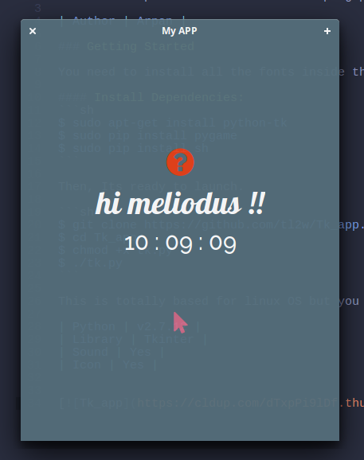

# Tk_app
Yet another practice files for developing python based desktop application.

| Author | Arpan |

### Getting Started

You need to install all the fonts inside the fonts directory.

#### Install Dependencies:
```sh
$ sudo apt-get install python-tk
$ sudo pip install pygame
$ sudo pip install sh
```

Then, Its ready to launch.

```sh
$ git clone https://github.com/tl2w/Tk_app.git
$ cd Tk_app
$ chmod +x tk.py
$ ./tk.py
```

This is totally based for linux OS but you can make your own modification to work for other OS.

| Python | v2.7.12 |
| Library | Tkinter |
| Sound | Yes |
| Icon | Yes |



